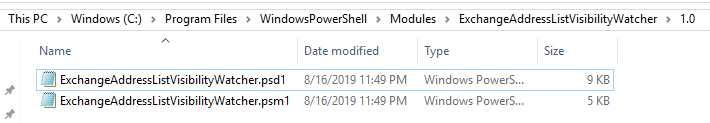

# ExchangeAddressListVisibilityWatcher
 
## SYNOPSIS
This module can be used to watch specific groups for membership changes, and then triggers the hide or unhide of the recipient object from the address lists.

## CmdLets

## GetCurrentGroupMembers
Use this command to get the current members list of the target group.

The output values are the members' ObjectGUID.

### SYNTAX
```
GetCurrentGroupMembers [-GroupID] <string>
 [<CommonParameters>]
```
## CompareGroupMembers
Command to compare the current member list and the previous member list to determine whether new members are added or removed.

### SYNTAX
```
CompareGroupMembers [-CurrentMemberList] <string[]>
 [-PreviousMemberList] <string[]> [<CommonParameters>]
```

## HideFromGal
Command to hide recipient object from the address list

### SYNTAX
```
HideFromGal [-HideList] <string[]>
 [<CommonParameters>]
```

## UnHideFromGal
Command to unhide recipient object from the address list

### SYNTAX
```
UnHideFromGal [-HideList] <string[]>
 [<CommonParameters>]
```

## UpdateAddressListVisibility
The main command to execute to perform the update workflow.

This also has the option to trigger an update of the Global Address List.

### SYNTAX
```
UpdateAddressListVisibility [-GroupID] <string>
 [-HistoryFile] <string>
 [-UpdatelGlobalAddressList]
 [<CommonParameters>]
```

## DESCRIPTION
You need to be assigned permissions before you can use this function properly. This module requires the ActiveDirectory Module and the Microsoft.Exchange.Management.PowerShell.E2010 Snap-In - which is included in the Exchange Management Tools.

## HOW TO INSTALL
You can install this several ways

## MANUAL FROM GITHUB
1. Download the code (zip)
2. Extract to your chosen $env:PSModulePath
    - (eg. C:\Program Files\WindowsPowerShell\Modules)
3. The folder structure must be "\ExchangeAddressListVisibilityWatcher\<version>"
    - (eg. C:\Program Files\WindowsPowerShell\Modules\ExchangeAddressListVisibilityWatcher\1.0)



